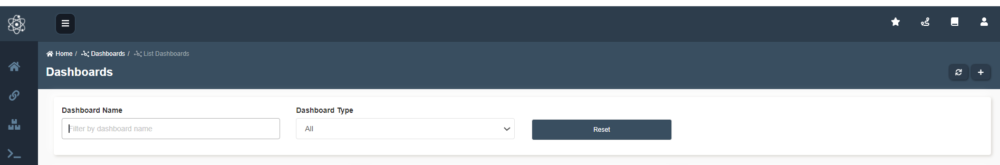
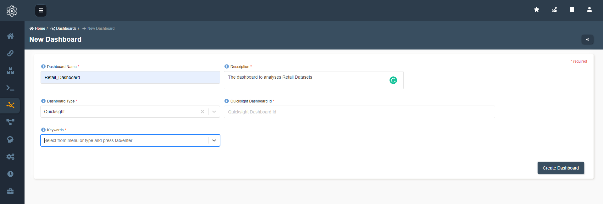

---
title: Connect Dashboard-to Amorphic
---------

:::info
- Follow the steps mentioned below.
- Total time taken for this task:  **10 Minutes**.
- Pre-requisites: Quicksight Dashboard ID or URL of any other published Dashboard
:::

To create a new dashboard, goto `home -> Dashboards` and click the `+` on top right.
This is the default page when Amorphic open

Add the required information `Dashboard Name, Description, Dashboard Type`. Select the Dashboard Type as `Quicksight` to attach quicksight dashboard else choose `Others`.
Enter Quicksight Dashboard ID and click `Create Dashboard`

Goto dashboard which you have created and click `View Dashboard`

