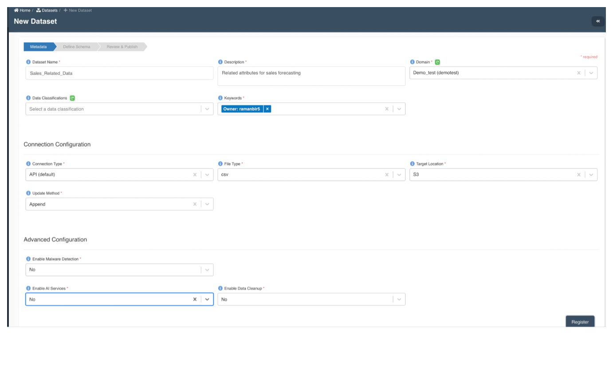

:::info
- Follow the steps mentioned below.
- Total time taken for this task:  **10 Minutes**.
- Pre-requisites: None
:::

- Step 1 - Data for forcasting has already beem prepared and the two datatsets in csv file format can be downloaded here -  [Target](./media/Target.csv), [Related](./media/Related.csv)

i) Target csv attributes: These are the mandatory attributes required for forecasting. It includes the following columns and we will be required to specify repsective formats for each attribute as we go through the steps later-

|      | Fields      | Format |
| :----: | :----: | :----: | 
| 1.| Format       | float64        |  
| 2.| timestamp       | datetime64[ns]       |  
| 3.| item_id       | object      |  

ii) Related attributes : These are additional attributes we are looking to include in the forecasting process. We will be required to specify repsective formats for each attribute as we go through the steps later -

|Fields | Format |
| :----: | :----: | 
|Store_Name|               object|
|Region        |              object|
|food_or_non_food  |          object|
|Division          |          object|
|Main_Category_Name  |object|
|COGS_in_NNBP     |     object|
|Gross_Profit_pct    |       object|
|timestamp            |   datetime64[ns]|
|item_id             |          object|

- Step 2 - Create Amorphic datasets for the “Target” & the “Related” csv files respectively. 
The following screenshots have sample values and connection configuration for the ‘Target’ & the ‘Related’ datasets to be created in Amorphic.
 

After registering the dataset, we navigate to the "Files" tab as shown in the screen below. ‘Target.csv’ & ‘Related.csv’ files can be uploaded by clicking on this icon -

  

