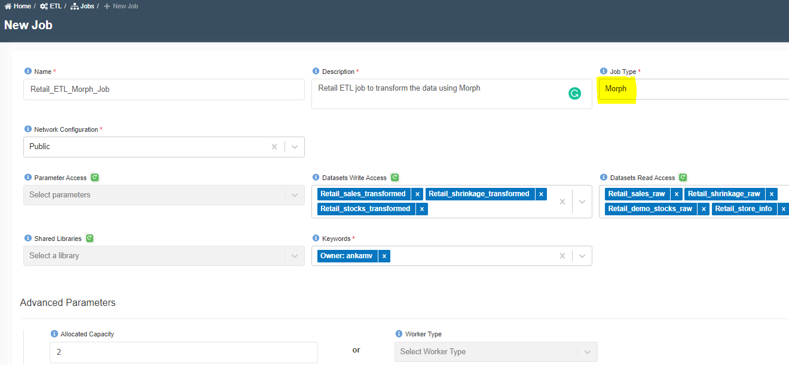
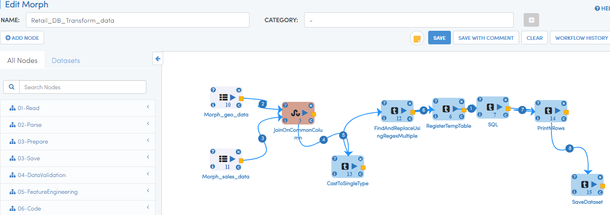

:::info
- Follow the steps mentioned below.
- Total time taken for this task:  **15 Minutes**.
- Pre-requisites: 'Create Spark Job' in ETL section. 
:::

## Create a Morph Job to explore it

- Click on 'ETL' --> 'Jobs' from left side menu. 
- Click on '+' icon at the top right corner to create a new job.
- Enter following information. 

```
Name: Retail_ETL_Morph_Job
Description: Retail ETL job to transform the data using Morph
Job Type: Morph
Network Configuration: Public
Bookmark: Disable
Parameter Access:
Datasets Write Access: Retail_sales_transformed, Retail_shrinkage_transformed, Retail_stocks_transformed 
Datasets Read Access: Retail_sales_raw, Retail_shrinkage_raw, Retail_stocks_raw, Retail_store_info
Shared Libraries:
Keywords: Retail
Allocated Capacity: 2
Max Concurrent Runs, Max Retries, Timeout, Notify Delay After: Leave them as is (A default value will be assigned)
Glue Version: Disabled
```


- Click on 'Submit' at the bottom.  You will get a message as shown below. Click OK.


- You will be routed to Morph Job page. If you see login page of Amorphic, click 'Back' icon at the top right corner. 
- Click on 'Edit Morph Script Icon'
- Add two ReadDataset nodes
- Double click on the hamburger icon of the first Dataset.
- Select Amorphic Dataset as 'Retail_store_info'
- Click on 'Refresh Schema' and wait for status bar to complete. Click OK.  
- Click play icon to see sample data.
- Double click on the hamburger icon of the second Dataset.
- Select Amorphic Dataset as 'Retail_sales_info'
- Click on 'Refresh Schema' and wait for status bar to complete. Click OK. 
- Click play icon to see sample data.
- Enter 'join' in search nodes box, drag 'JoinOnCommonColumn' node. 
- Join two Dataset nodes to join node using yellow icon. 
- Double click on 'JoinOnCommonColumn' node, COMMON JOIN COLUMN as 'store_no'. Click OK. 
- Click play icon to see joined data.

Try few other transformations or save nodes. 

The spark job equilant in Morph would be similar to the below image. 



:::tip Congratulations!!!

  You have successfully finished ETL task. Now, proceed to  **'Query Data'** or **'Forecasting Sales'** task. 

:::


