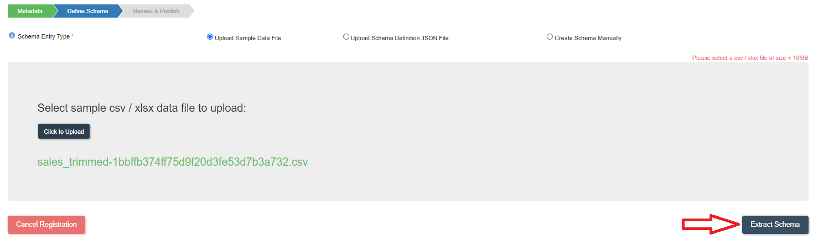

:::info
- Follow the steps mentioned below.
- Total time taken for this task:  **10 Minutes**.
- Pre-requisites: Ingestion Task
:::

<br/><br/>
Types of ETL on Amorphic:

| Types of ETL      | Description | Target Audience |
| :----: | :----: |  :----: |
| 1. Using Spark job       | Write Pyspark code        |  Experienced Pyspark Developer       |
| 2. Using Morph job       | Create a Drag and Drop Job       |  Any ETL developer / Business Analyst        |

For this workshop, we will use a pre-written Spark code. But, we will also explore the Morph job. 

For both methods, we need to create three output **'Datasets'** to write the data from the job. Best part of Amorphic is - these datasets will automatically write data to Redshift tables without any additional coding.   So, let's create three **Datasets.**

## Create Retail_sales_transformed Dataset

- Click on 'DATASETS' --> 'Datasets' from left side menu. 
- Click on '+' icon at the top right corner.
- Enter following information 

```
{
  "Dataset Name": "Retail_sales_transformed"
  "Description": "Output dataset for sales transformed data. The target location is Redshift."
  "Domain": "1Landing Zone(landingzone)"
  "Data Classifications": "Raw"
  "Keywords": "Retail"
  "Connection Type": "API (default)"
  "File Type": "csv"
  "Target Location": "Redshift"
  "Update Method": "Append"
  "My Data Files Have Headers": "Yes"
  "Custom Delimiter": ","
  "Enable Malware Detection": "No"
  "Enable Data Profiling": "No"
}
```


- Click on **'Register'** button at the bottom to move to next step.
- Click on the following CSV file to download it to your computer.

[Sample Sales CSV File](./media/sales_trimmed.csv)

- Click on **'Click to upload'** to upload the file that is downloaded in above step.
- Click on **'Extract Schema'** as shown below.



- You will get a message 'File uploaded successfully'.  Click OK.
- A new screen will appear with the schema extracted as shown below. 


- Verify the columns and data types.
- Change the 'Sort Key Type' to None.
- Click on **'Publish Dataset'**. You will get 'Completed the registration process successfully' message. Click OK.

Now, above steps to be repeated for creating two more datasets.  The only difference is 'Dataset Name', 'Description' and 'Sample CSV file' that are listed below. 

## Create Retail_shrinkage_transformed Dataset

```
{
  "Dataset Name": "Retail_shrinkage_transformed"
  "Description": "Output dataset for shrinkage transformed data. The target location is Redshift."
}
```
[Sample Shrinkage CSV File](./media/shrinkage_trimmed.csv)


## Create Retail_stocks_transformed Dataset

```
{
  "Dataset Name": "Retail_stocks_transformed"
  "Description": "Output dataset for stocks transformed data. The target location is Redshift."
}
```
[Sample Stocks CSV File](./media/stocks_trimmed.csv)


:::tip Congratulations!!!

  You have successfully created three output datasets task. Now, proceed to **'Create Spark Job'** task. 

:::


