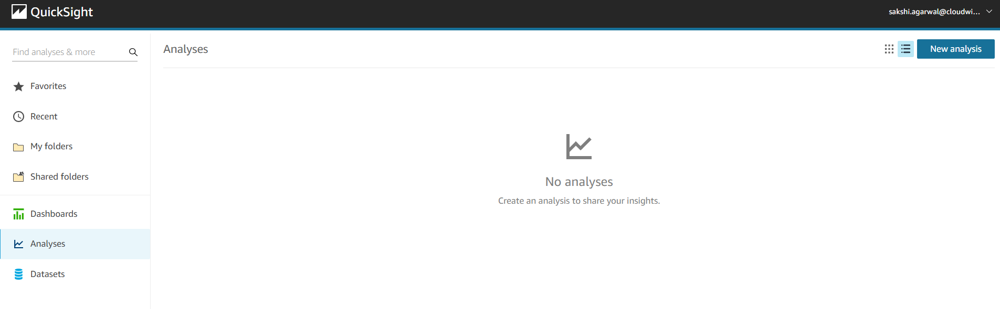
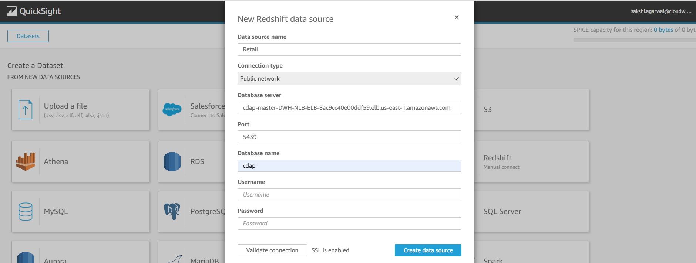
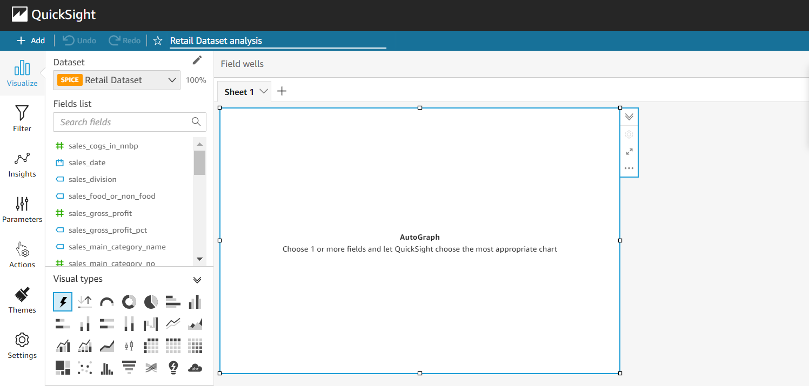
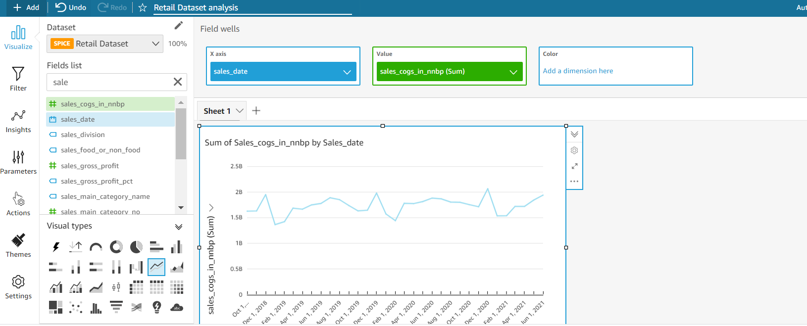

:::info
- Follow the steps mentioned below.
- Total time taken for this task:  **20 Minutes**.
- Pre-requisites: Quicksight Login Credentials
:::

When you create a dashboard, the typical workflow looks like this:
- Create a new analysis.
- Add new or existing datasets.
- Choose fields to create the first chart. QuickSight automatically suggests the best visualization.
- Add more charts, tables, or insights to the analysis. Resize and rearrange them on one or more sheets.
- Use extended features to add variables, custom controls, colors, additional pages (called sheets), and more.
- Publish the analysis as a dashboard to share it with other people.

Dashboards come in a wide variety of designs, depending on what you do and the analytics that you need to do it well. Using QuickSight, you can interact with your data on a webpage or your mobile device. If you also subscribe by mail, you can see a static preview of it.

You can sign-in on the Amazon QuickSight page, https://quicksight.aws.amazon.com/. Follow the screen prompts to sign in. 
Once you are logged in Quickight.The default page will look like this.

Use the following procedure to use the **Retail dataset**  to create an analysis containing a line chart visual. This visual shows the total sales by month.

To connect to the Retail data, use the following steps:
- Choose New dataset from the New analysis screen. (Or, choose Datasets at left, and then choose New dataset.)
- Choose Redshift Manual Connect.
- Add the Redshift connection details for the Retail Data, this can be extracted from Amorphic. Below are the steps
    - Login to Amorphic
    - Goto Datasets -> Desired Dataset -> View Details
    - Goto Profile and copy Host to be entered in connection details
    - Get the schema name

- Choose Create  data source
- Choose the desired schema name  
- Choose the desired table
- Choose Visualize or Edit/Preview Data to make any data changes.

Choosing Visualize brings you to the screen where you can drag and drop the fields and analyze the data.

In the Fields list pane, choose Date, and then choose Sales this will create a time-series graph of sales.

Once analysis is completed it needs to be Published as a Dashboard in Quicksight, to do so follow the below steps:
- Click on Share as the top right of the screen
- Choose Publish Dashboard
- Provide the dashboard Name
- Click Publish Dashboard
- Choose the list of people to share the dashboard else click "Share with everyone in this account"
- Extract the Dashboard ID from the URL

To view all the dashboards you can goto Dashboard Navigator on the Quicksight page and explore.

