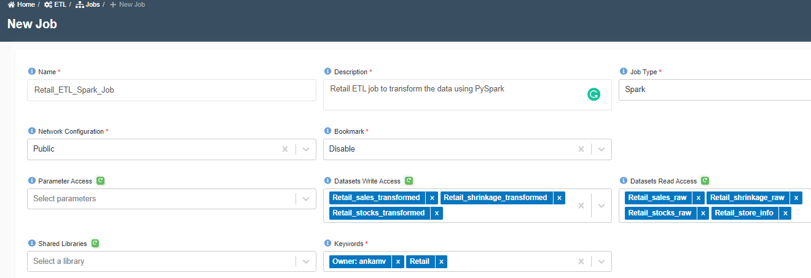
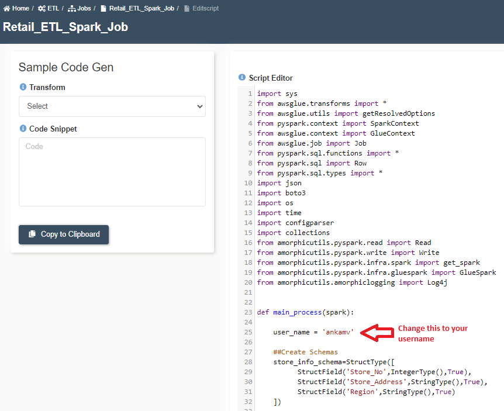
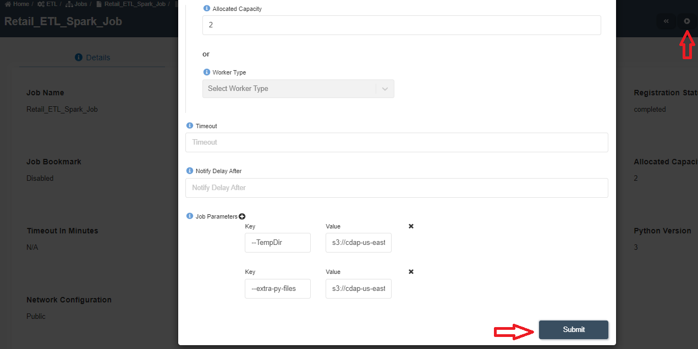

:::info
- Follow the steps mentioned below.
- Total time taken for this task:  **5 Minutes**.
- Pre-requisites: 'Create Datasets' in ETL section. 
:::

## Create a Spark Job to transform data

- Click on 'ETL' --> 'Jobs' from left side menu. 
- Click on '+' icon at the top right corner to create a new job.
- Enter following information. 

```
Name: Retail_ETL_Spark_Job
Description: Retail ETL job to transform the data using PySpark
Job Type: Spark
Network Configuration: Public
Bookmark: Disable
Parameter Access:
Datasets Write Access: Retail_sales_transformed, Retail_shrinkage_transformed, Retail_stocks_transformed 
Datasets Read Access: Retail_sales_raw, Retail_shrinkage_raw, Retail_stocks_raw, Retail_store_info
Shared Libraries:
Keywords: Retail
Allocated Capacity: 2
Max Concurrent Runs, Max Retries, Timeout, Notify Delay After: Leave them as is (A default value will be assigned)
Glue Version: 2.0
Python Version: 3
Job Parameters: 
```


- Click on 'Submit' at the bottom.  You will get a message as shown below.


- A new script editor window with a default code will appear. 
- Toggle the 'Read mode on' button to get into edit mode.
- Delete the existing code and enter the following code block.

```
import sys 
from awsglue.transforms import * 
from awsglue.utils import getResolvedOptions 
from pyspark.context import SparkContext 
from awsglue.context import GlueContext 
from awsglue.job import Job 
from pyspark.sql.functions import *
from pyspark.sql import Row
from pyspark.sql.types import *
import json
import boto3
import os
import time
import configparser
import collections
from amorphicutils.pyspark.read import Read
from amorphicutils.pyspark.write import Write
from amorphicutils.pyspark.infra.spark import get_spark
from amorphicutils.pyspark.infra.gluespark import GlueSpark
from amorphicutils.amorphiclogging import Log4j


def main_process(spark):
        
    user_name = 'ankamv'

    ##Create Schemas
    store_info_schema=StructType([
          StructField('Store_No',IntegerType(),True),
          StructField('Store_Address',StringType(),True),
          StructField('Region',StringType(),True)
    ])
    
    sales_schema=StructType([
          StructField('Month_Id',StringType(),True),
          StructField('Location',StringType(),True),
          StructField('Store_No',IntegerType(),True),
          StructField('Store_Name',StringType(),True),
          StructField('food_or_non_food',StringType(),True),
          StructField('Division',StringType(),True),
          StructField('Main_Category_No',IntegerType(),True),
          StructField('Main_Category_Name',StringType(),True),
          StructField('Sales_in_NSP',DoubleType(),True),
          StructField('COGS_in_NNBP',DoubleType(),True),
          StructField('Gross_Profit',DoubleType(),True),
          StructField('Gross_Profit_pct',StringType(),True)
    ])
    
    stocks_schema=StructType([
          StructField('Store_No',IntegerType(),True),
          StructField('Main_Category',IntegerType(),True),
          StructField('Main_Category_Name',StringType(),True),
          StructField('food_or_non_food',StringType(),True),
          StructField('Division',StringType(),True),
          StructField('Date',StringType(),True),
          StructField('Stocks',DoubleType(),True)
    ])
    
    shrinkage_schema=StructType([
          StructField('Location',StringType(),True),
          StructField('Month_Id',StringType(),True),
          StructField('Store_No',IntegerType(),True),
          StructField('Store_Name',StringType(),True),
          StructField('Main_Category_No',StringType(),True),
          StructField('Main_Category_Name',StringType(),True),
          StructField('Shrinkage',DoubleType(),True)
    ])

     
    print("reading data")

    
    _csv_reader = Read("cdap-us-east-1-802489652583-master-dlz", spark)
    source_response = _csv_reader.read_csv_data("ingestion","Retail_store_info",header=False,schema=store_info_schema)
    store_df = source_response['data']
    #store_df.show(10)
    
    #Read and cleanse Sales data
    source_response = _csv_reader.read_csv_data("ingestion","Retail_sales_raw",header=False,schema=sales_schema)
    sales_df = source_response['data']
    sales_df = sales_df.join(store_df,'Store_No')
    sales_df = sales_df.select(regexp_replace('Month_Id', '2012', '2018').alias('Month_Id1'), '*').drop('Month_Id')
    sales_df = sales_df.select(regexp_replace('Month_Id1', '2013', '2019').alias('Month_Id2'), '*').drop('Month_Id1')
    sales_df = sales_df.select(regexp_replace('Month_Id2', '2014', '2020').alias('Month_Id3'), '*').drop('Month_Id2')
    sales_df = sales_df.select(regexp_replace('Month_Id3', '2015', '2021').alias('Month_Id4'), '*').drop('Month_Id3')
    sales_df = sales_df.withColumnRenamed('Month_Id4', 'Month_Id')
    sales_df = sales_df.withColumn("date", to_date('Month_Id', 'yyyyMM'))
    sales_df = sales_df.select('Month_Id','Store_No','Store_Name','Store_Address','Region','food_or_non_food','Division','Main_Category_No','Main_Category_Name','Sales_in_NSP','COGS_in_NNBP','Gross_Profit','Gross_Profit_pct','date')
    #sales_df.show(10)
    
    source_response = _csv_reader.read_csv_data("ingestion","Retail_stocks_raw",header=False,schema=stocks_schema)
    stocks_df = source_response['data']
    stocks_df = stocks_df.join(store_df,'Store_No')
    stocks_df = stocks_df.select('Store_No','Store_Address','Region','Main_Category','Main_Category_Name','food_or_non_food','Division','Date','Stocks')
    #stocks_df.show(10)
    
    source_response = _csv_reader.read_csv_data("ingestion","Retail_shrinkage_raw",header=False,schema=shrinkage_schema)
    shrinkage_df = source_response['data']
    shrinkage_df = shrinkage_df.join(store_df,'Store_No')
    shrinkage_df = shrinkage_df.select(regexp_replace('Month_Id', '2012', '2018').alias('Month_Id1'), '*').drop('Month_Id')
    shrinkage_df = shrinkage_df.select(regexp_replace('Month_Id1', '2013', '2019').alias('Month_Id2'), '*').drop('Month_Id1')
    shrinkage_df = shrinkage_df.select(regexp_replace('Month_Id2', '2014', '2020').alias('Month_Id3'), '*').drop('Month_Id2')
    shrinkage_df = shrinkage_df.select(regexp_replace('Month_Id3', '2015', '2021').alias('Month_Id4'), '*').drop('Month_Id3')
    shrinkage_df = shrinkage_df.withColumnRenamed('Month_Id4', 'Month_Id')
    shrinkage_df = shrinkage_df.withColumn("date", to_date('Month_Id', 'yyyyMM'))
    shrinkage_df = shrinkage_df.select('Month_Id','Store_No','Store_Name','Store_Address','Region','Main_Category_No','Main_Category_Name','Shrinkage','date')
    #shrinkage_df.show(10)

    #print("writing sales data")
    writer = Write("cdap-us-east-1-802489652583-master-lz", spark)
    epoch = str(int(time.time()))
    response = writer.write_csv_data(sales_df.repartition(1), "landingzone", 'Retail_sales_transformed', user=user_name, file_type="csv", header=True, delimiter=",", quote=False, upload_date=epoch)

    if response['exitcode'] == 0:
       print("Successfully wrote data....")
    else:
       print("Error writing distinct udc data.... : ", response['message'])
       sys.exit(response['message'])
    print("Successfully wrote data....")

    
    print("writing stocks data")
    epoch = str(int(time.time()))
    response = writer.write_csv_data(stocks_df.repartition(1), "landingzone", 'Retail_stocks_transformed', user=user_name , file_type="csv", header=True, delimiter=",", quote=False, upload_date=epoch)

    if response['exitcode'] == 0:
       print("Successfully wrote data....")
    else:
       print("Error writing distinct udc data.... : ", response['message'])
       sys.exit(response['message'])
    print("Successfully wrote data....")

    print("writing shrinkage data")
    epoch = str(int(time.time()))
    response = writer.write_csv_data(shrinkage_df.repartition(1), "landingzone", 'Retail_shrinkage_transformed', user=user_name, file_type="csv", header=True, delimiter=",", quote=False, upload_date=epoch)
    if response['exitcode'] == 0:
       print("Successfully wrote data....")
    else:
       print("Error writing distinct udc data.... : ", response['message'])
       sys.exit(response['message'])
    print("Successfully wrote data....")

   
          
if __name__ == "__main__":
    ## @params: [JOB_NAME] 
    args = getResolvedOptions(sys.argv, ['JOB_NAME']) 
    sc = SparkContext() 
    glueContext = GlueContext(sc) 
    spark = glueContext.spark_session 
    job = Job(glueContext) 
    job.init(args['JOB_NAME'], args)
    main_process(spark)
    job.commit()
```



- You need to change user_name to your username in the program.  You can find your username at https://demo.cwdl.cloudwick.com/settings/profile.   
- Click on 'Save & Publish' button to save the script.
- Download the following file to your computer. 

[Amorphicutils Library - Click here to download](./media/amorphicutils.zip)

- Rename the file as 'amorphicutils.zip'
- Click on **'Update External Libs'** and select the amorphicutils.zip file and upload it. This will add an argument '--extra-py-files' to the job 
- Click on 'Run Job' button at the top right corner. 
- Click on 'Submit' on the popped-up window as show below.



- Click on 'Executions' tab and click refresh button to get the latest status of the job. 
- Once the job is finished, you will see a green colored 'succeeded' icon. 
- You may go to the output datsets to check the status of newly written files. Once all the files are processed, it will show green status with a message "Permanent S3 Redshift COPY successful".
- You may check "Output" or "Error" logs by clicking on three dots in front of the finished job. 

:::tip Congratulations!!!

  You have successfully finished creating and running a Spark job. Now, proceed to **'Create Morph Job'** task. 

:::


