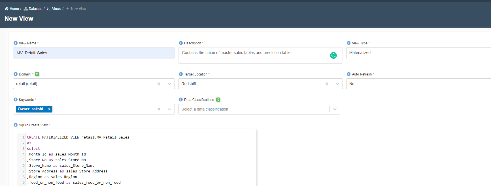

---
title: Create Materialized View
---------

:::info
- Follow the steps mentioned below.
- Total time taken for this task:  **10 Minutes**.
- Pre-requisites: Redshift tables
:::

A materialized view contains a precomputed result set, based on an SQL query over one or more base tables. You can issue SELECT statements to query a materialized view, in the same way that you can query other tables or views in the database.
When you create a materialized view, Amazon Redshift runs the user-specified SQL statement to gather the data from the base table or tables and stores the result set.


To create a materialized view follow the below steps:
- Goto `home -> Datasets -> Views -> New Views` 
- Add the required information `View Name and View Description`
- Choose `View Type` as `Materialized`
- Choose `Domain` in which you want to create a view
- Choose `Target Location` as `Redshift`
- Choose `Auto Refresh` as `Yes` to update the materialized view else `No`
- Add the SQL Query to create a view as shown below
- Click Submit

```
CREATE MATERIALIZED VIEW demotest.MV_Retail_Sales
as
select
 Month_Id as sales_Month_Id
,Store_No as sales_Store_No
,Store_Name as sales_Store_Name
,Store_Address as sales_Store_Address
,Region as sales_Region
,food_or_non_food as sales_food_or_non_food
,Division as sales_Division
,Main_Category_No as sales_Main_Category_No
,Main_Category_Name as sales_Main_Category_Name
,Sales_in_NSP as sales_Sales_in_NSP
,COGS_in_NNBP as sales_COGS_in_NNBP
,Gross_Profit as sales_Gross_Profit
,split_part(Gross_Profit_pct, '%',1) as sales_Gross_Profit_pct
,TO_DATE( date,'YYYY-MM-DD HH24:MI:SS') as sales_date
,0 as p10
, 0 as p50
,0 as p90
from landingzone.Retail_sales_transformed
union all
Select
0 as sales_Month_Id
,cast(Store_No as integer) as sales_Store_No
,Store_Name as sales_Store_Name
,NULL as sales_Store_Address
,Region as sales_Region
,food_or_non_food as sales_food_or_non_food
,Division as sales_Division
,cast(Main_Category_No as integer) as sales_Main_Category_No
,Main_Category_Name_x as sales_Main_Category_Name
,0.0 as sales_Sales_in_NSP
,cast(COGS_in_NNBP as decimal (10,2))as sales_COGS_in_NNBP
,0.0 as sales_Gross_Profit
,split_part(Gross_Profit_pct, '%',1) as sales_Gross_Profit_pct
,to_date(split_part(r_predict.date, 'T',1),'YYYY-MM-DD HH24:MI:SS')  as sales_date
,cast(p10 as decimal(10,2))
,cast(p50 as decimal(10,2))
,cast(p90 as decimal(10,2))
from demotest.retail_mapped_sales_predictions r_predict
```




Once the materialized view is created it ready to be used for dashboarding.


