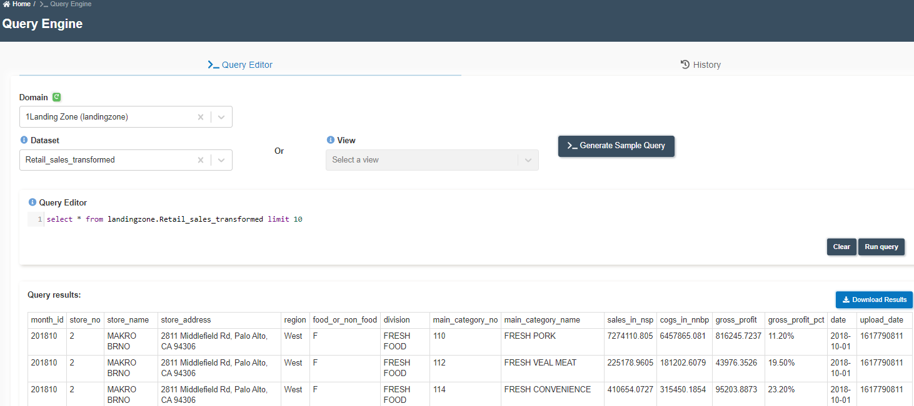

:::info
- Follow the steps mentioned below.
- Total time taken for this task:  **2 Minutes**.
- Pre-requisites: 'Create Spark Job' in ETL section. 
:::

## Query the transformed tables

- Go to 'QUERY ENGINE' from the left side menu.
- Select the domain as 1landingZone(landingzone)
- Select Dataset as 'Retail_sales_transformed'
- Click on 'Generate Sample Query' or write any query of your own.
- Click on 'Run Query'
- Click on 'Refresh Query Status'
- Click on 'View Results' once the query status becomes 'SUCCEEDED'

- Click on 'Download Results' to download the result as a CSV file. 

:::tip Congratulations!!!

  You have successfully queried tables. Now, proceed to **'Forecasting Sales'** task. 

:::

