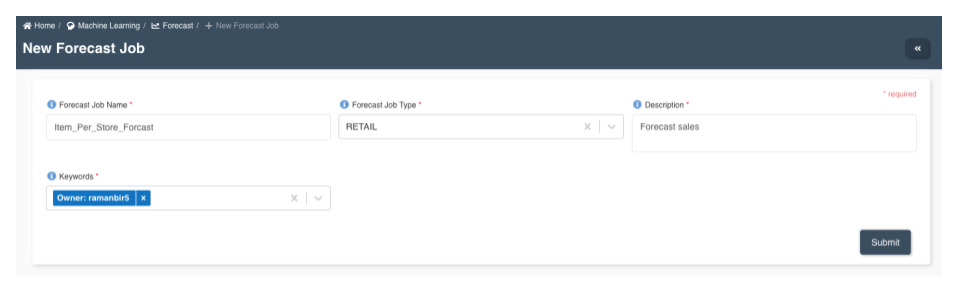
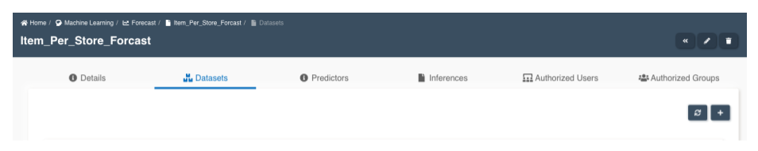
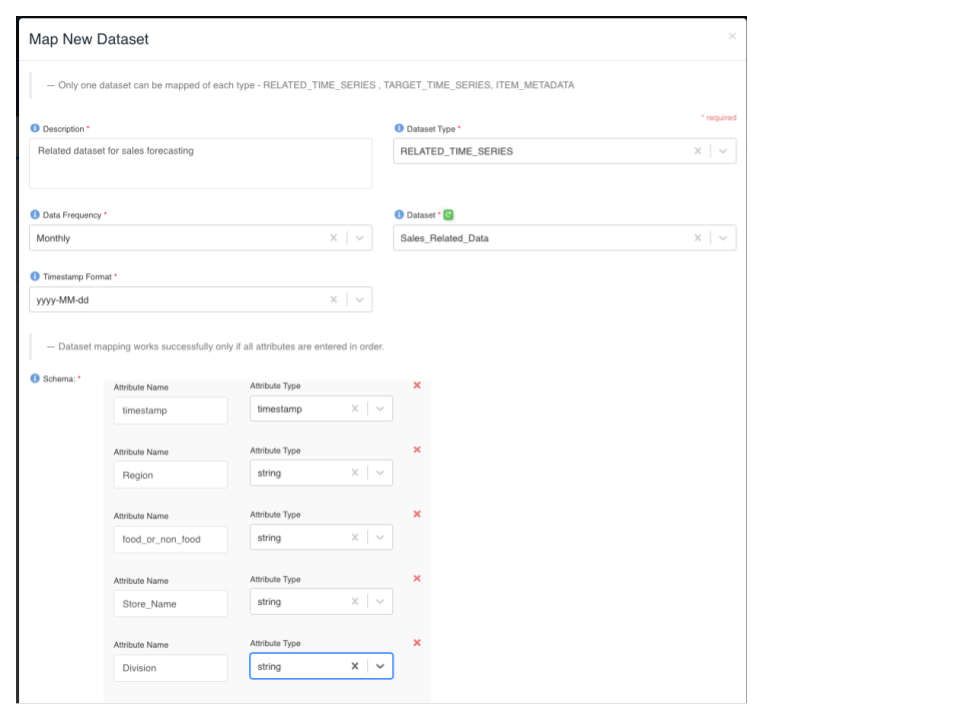
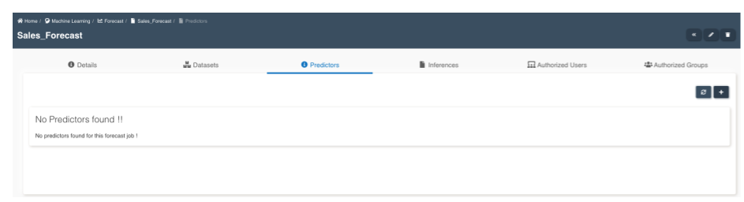
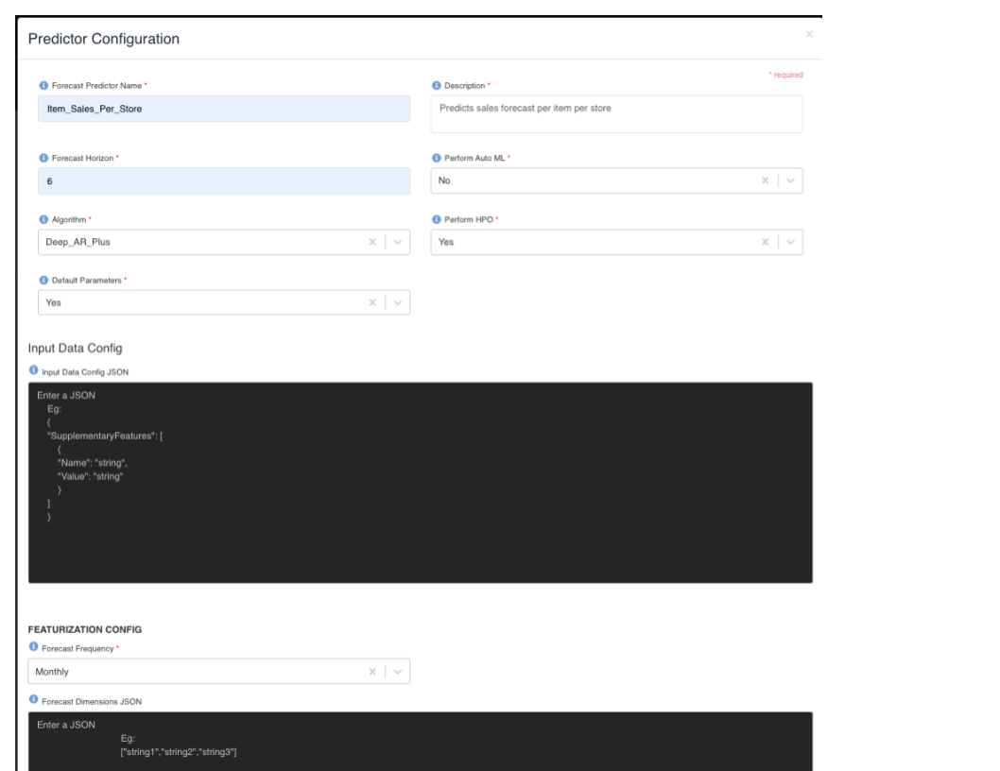
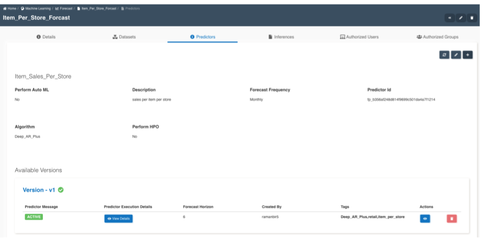
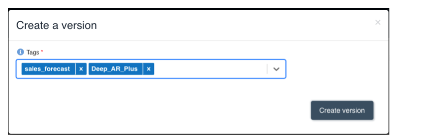
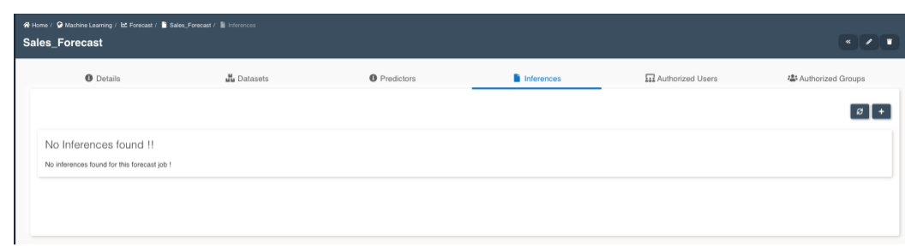
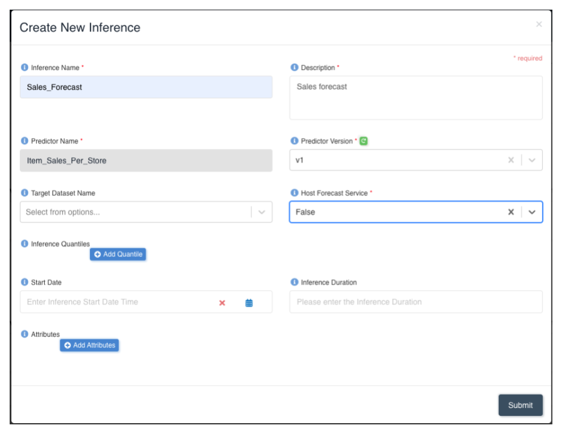
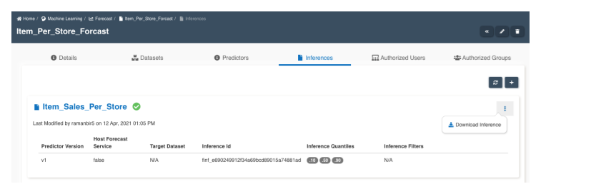

:::info
- Follow the steps mentioned below.
- Total time taken for this task:  ** 2 hours **.
- Pre-requisites: Datasets creation for forecasting
:::

- Step 1 - Navigate to the forecasting link -

Create a forecast job by clicking on the link "Create Forecast Job" - 

Enter details to setup forecasting job and submit. This sets a job for running AWS Forecasting service

- Step 2 - Map datasets for the forecast job by navigating to the 'Datasets' tab -

i)  Map the “TargetSalesData” dataset and submit the form. Make sure the attribute formats are correctly specified as shown in the screen below  - 

ii) Map the “Sales_Related_Data” dataset. All variables listed in the "Related attributes" section above must be mapped as "String" format with the exception of "timestamp". Submit the form once done - 

The above actions will take approx 20-30 mins to complete. You will need to wait for this step to complete before you can proceed to the next steps.

- Step 3 - Configure a ‘Predictor’ for the forecast job

Predictor configuration is where the algorithm to be used and the parameters that are required by the algorithm are configured. First navigate to the "Predictors" tab -

Click on "+" icon on the screen to create a predictor. Enter the sample values as shown in the screen below and "submit" the form -

This step will take 20-30 mins to complete.

- Step 4 - Create a version for the Forecast predictor. It uses the configuration and its associated parameters to create the version which can then be used to create an inference.

We need to navigate to the "Predictors" tab to create a version.

Click on the ‘+’ icon to create a new version for the predictor. Add tags for the version. Tags can be associated with a version for distinguishing it from other versions.

This step will take 20-30 mins to complete.

- Step 5 - Create an inference and submit the job.

Navigate to the "Inferences" tab -

Click on "+" icon to create an Inference.  

This step will take approx. 30 mins to complete. Inference generates a csv file based on the input. The file generated can be downloaded or can be saved directly to an Amorphic Dataset. 

- Step 6 - Download predictions once the job has completed. The link to download the files can seen in the screen below -

We have three predictions in the output representing varying confidance levels - P10, P50 & P90. A sample output is as follows -

The csv file with the predictions can be downloaded here - 
[Predictions ](./media/Mapped_Prediction.csv)

