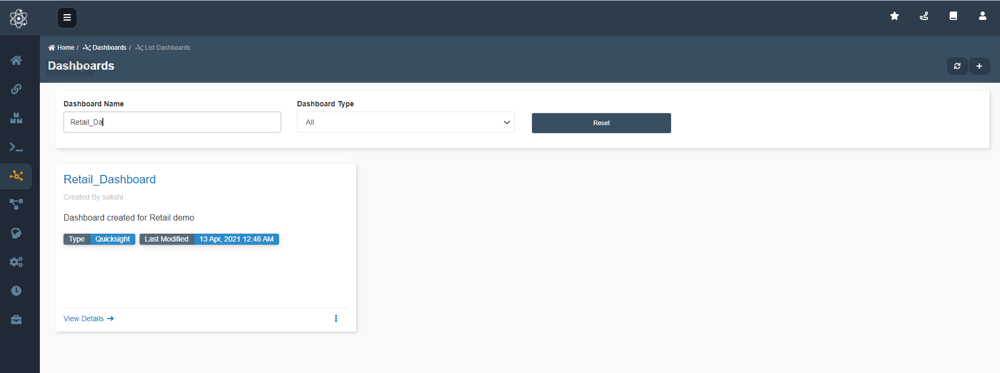
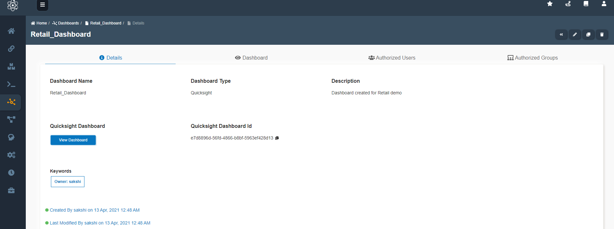
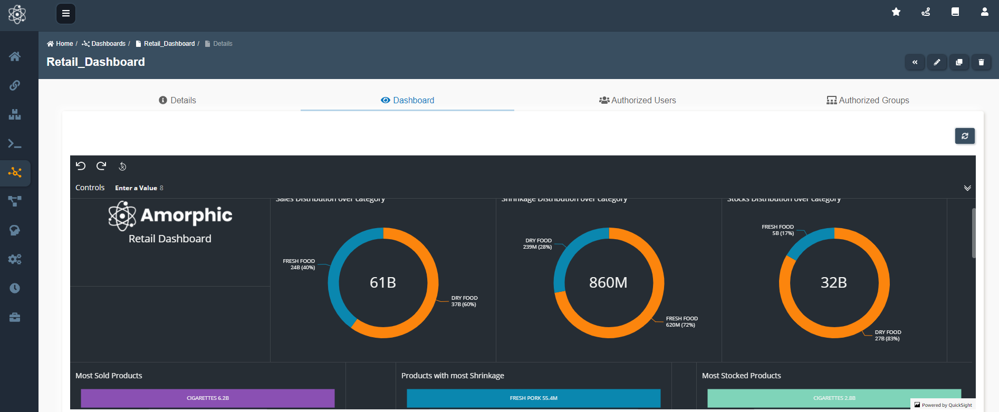

:::info
- Follow the steps mentioned below.
- Total time taken for this task:  **10 Minutes**.
- Pre-requisites: Access to inbuild Dashboard Templates
:::

To use the dashboard template, go to `home -> Dashboards`. Search for desired template either by *'Dashboard Name'* or *'Dashboard Type'*.
This is the default page when the Amorphic Dashboard tab opens.

Click `View Details -->` to view the dashboard Template. All the details related to the dashboard can be viewed.
To view the dashboard click `View Dashboard` as shown.

One can view the dashboards integrated on Amorphic and analyze the date.

   

### Happy Analysing !!!! {#custom-id}

