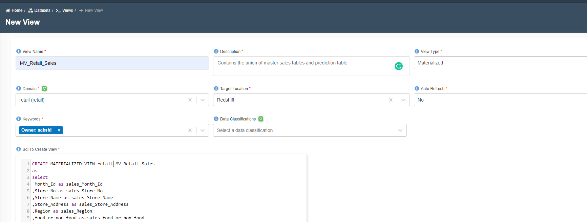

---
title: Create Materialized View
---------

:::info
- Follow the steps mentioned below.
- Total time taken for this task:  **10 Minutes**.
- Pre-requisites: Redshift tables
:::

A materialized view contains a precomputed result set, based on an SQL query over one or more base tables. You can issue SELECT statements to query a materialized view, in the same way that you can query other tables or views in the database.
When you create a materialized view, Amazon Redshift runs the user-specified SQL statement to gather the data from the base table or tables and stores the result set.

To create a materialized view follow the below steps:
- Goto `home -> Datasets -> Views -> New Views` 
- Add the required information `View Name and View Description`
- Choose `View Type` as `Materialized`
- Choose `Domain` in which you want to create a view
- Choose `Target Location` as `Redshift`
- Choose `Auto Refresh` as `Yes` to update the materialized view else `No`
- Add the SQL Query to create a view
- Click Submit

Once the materialized view is created it ready to be used for dashboarding.

