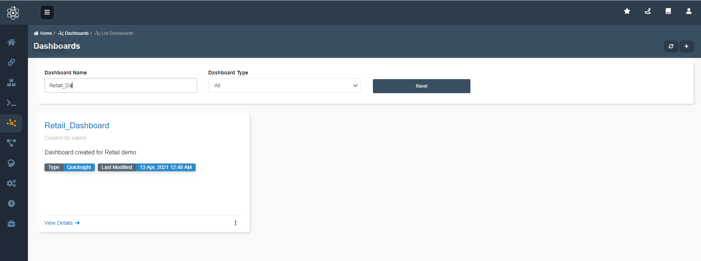
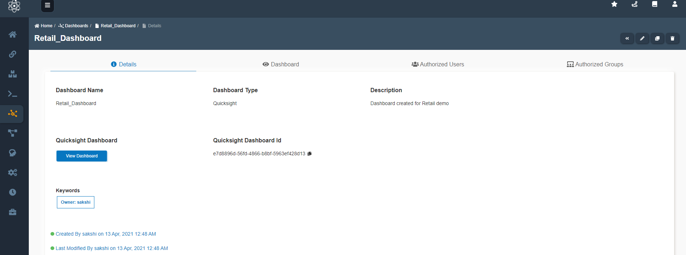
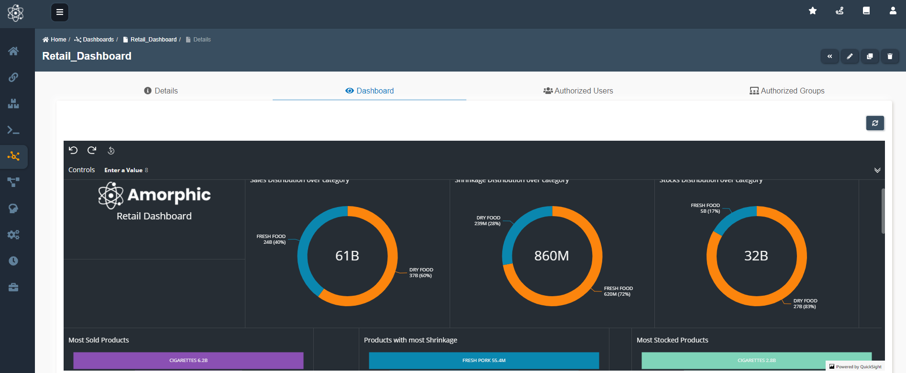

To use dashboard template, go to `home -> Dashboards`. Search for desired template either by *'Dashboard Name'* or *'Dashboard Type'*.
This is the default page when Amorphic Dashboard tab opens.

Click `View Details -->` to view the dashbaord Template. All the details related to the dashboard can be viewed.
To view the dashboard click `View Dashboard` as shown.

One can view the dashboards integrated on Amorphic and analyse the date.

### Happy Analysing!!!!

