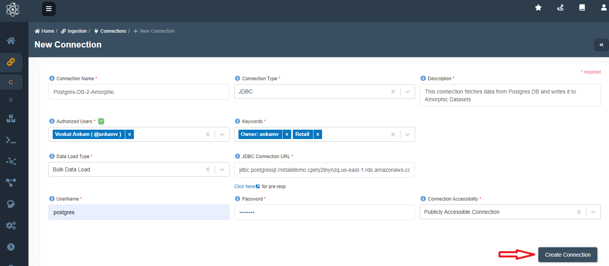
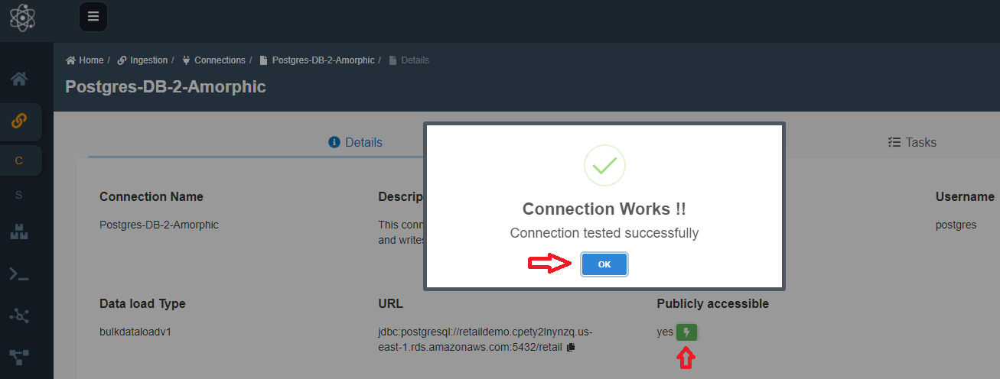
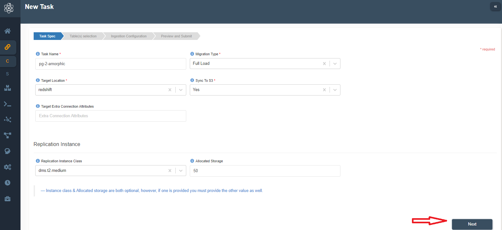
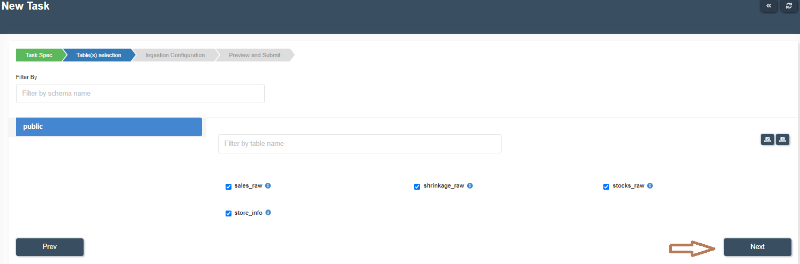
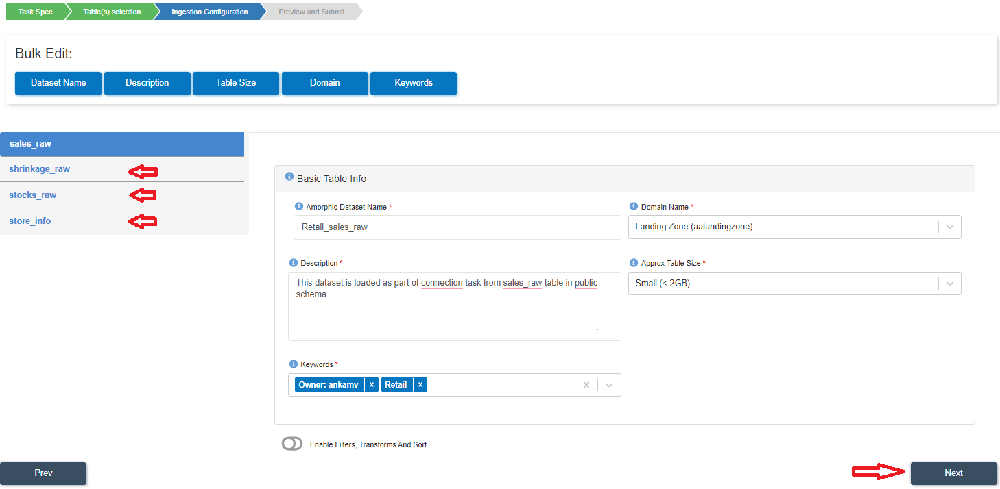
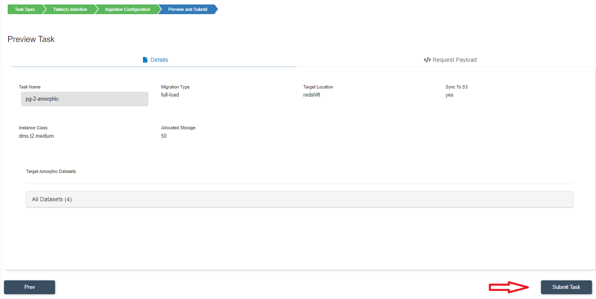
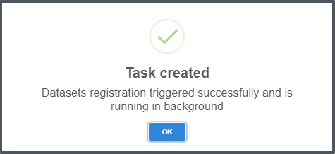
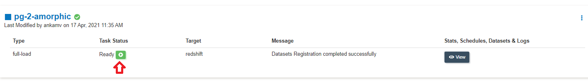
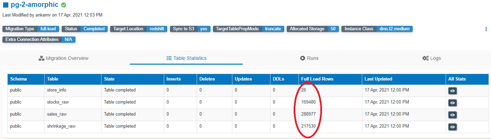

:::info
- Follow the steps mentioned below.
- Total time taken for this task:  **10 Minutes**.
- Pre-requisites: Setup Amorphic and login.
:::

## Check your role on Amorphic

- If your current role is **'SystemRole-DefaultUsers'**, you will have access to 'Datasets' and 'Groups' only. 
- Click on person icon at top right corner --> click on 'switch role' --> select the role to switch to --> click on switch role. 
- If you don't see any new role in the dropdown box, contact admin.

## Create a connection

- Click on **'Connections'** widget on the home screen. You may also click on 'Navigator' on top right corner and search for 'Connections' widget. 
- Click on a '+' icon at top right corner.
- Enter following details and click on create connection.

```Connection Name: Postgres-DB-2-Amorphic
Connection Type:  JDBC
Description: This connection fetches data from Postgres DB and writes it to Amorphic Datasets
Authorized Users: Select your user name and any other user names you want to grant permission
Keywords: Add relevant keywords like 'Retail'. Using this tag you can search later
Version: 2.0
Data Load Type: Bulk Data Load
JDBC Connection URL:  jdbc:postgresql://retaildemo.cpety2lnynzq.us-east-1.rds.amazonaws.com:5432/retail
User Name: postgres
Password: contact admin
Connection Accessibility: Publicly accessible Connection
```
Create Connection Screen Capture:


## Test Connection

- On the newly created connection page,
- Click on **flash** icon in 'Publicly Accessible' section.
- It should show **"Connection Works"** as shown in below image. Click 'OK'.
- If connection test fails, click on **'Edit Connection'** at top right corner and re-enter the details and click on 'Update'. 



## Create a Task

- Click on the 'Tasks' tab.  You will see 'No tasks found' or previously created tasks. 
- Click on '+' icon at top right corner to create a new task.
- Enter following details and click Next.

```Task Name: pg-2-amorphic
Migration Type:  Full load
Target Location: Redshift
Sync to S3: Yes
Target Extra Connection Attributes: 
Replication Instance Class: dms.t2.medium
Allocated Storage: 50
```


- Select `sales_raw` , `shrinkage_raw`, `stocks_raw`, `store_info` tables and click 'Next' as shown below. 



- Change information as mentioned below for all four tables. Tables can be selected by clicking on the table name at left side. You may also choose to bulk edit Dataset Name, Domain and Keywords.

```
Amorphic Dataset Name:  Change 'Task' to 'Retail'.  So, 'Task_sales_raw' will become 'Retail_sales_raw'
Domain Name:  Landing Zone(aalandingzone).  This will be used as schema in Redshift
Description:  Keep as it is
Approx Table Size: Small (< 2GB)
Keywords: Add 'Retail'
```

- Click **'Next'** only after changing above information for all tables as shown below. 



- In the last step, verify the details and click on **'Submit Task'** as shown below. 



You will see a message like this -->


- Once the Datasets are registered successfully, you will see a **Ready status** and a start button as shown below. 



- Click on start task button and you will get a message **'Start Task'**.  Click **'Yes, Start Task'** as shown below.


- Refresh the task status by clicking **'Refresh'** icon in front of 'Message'.
- Once the task status is **'Completed'**, Click on 'View' icon to check the statistics. 
- Click on **'Table Statistics'** tab.  You will see the stats similar to below image. 



- Now, click on **'Home'** button left side menu. Click on **Datasets** widget. You can click on 'DATASETS' --> 'Datasets' from left menu directly as well. 
- You will be able to see the datasets created as part of the task.
- Click on **'View Details'** of 'Retail_sales_raw' dataset widget.
- Click on 'Files' tab.
- You will see two CSV files created as part of the migration task. 

:::tip Congratulations!!!

  You have successfully finished data migration task. Now, proceed to **'ETL'** task. 

:::


