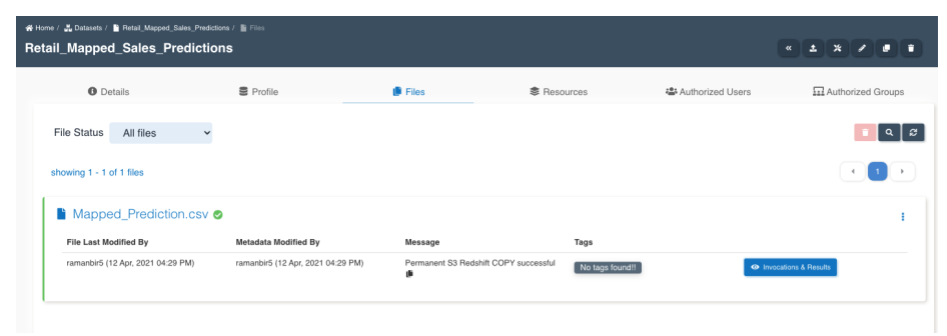
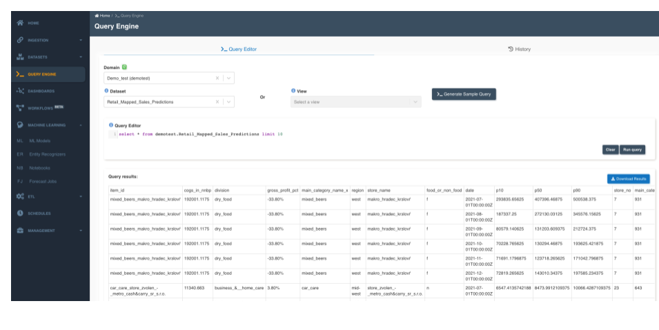

:::info
- Follow the steps mentioned below.
- Total time taken for this task:  ** 15 minutes **.
- Pre-requisites: Download predictions files
:::

- Step 1 - Create a dataset with the predictions downloaded from the forecasting job. 

 
- Step 2 - Upload the csv file (Mapped_Prediction.csv) into the dataset by clicking on the upload icon. The file will be uploaded as follows.

- Step 3 - The predictions can be queried by navigating to the "Query Engine" -

 